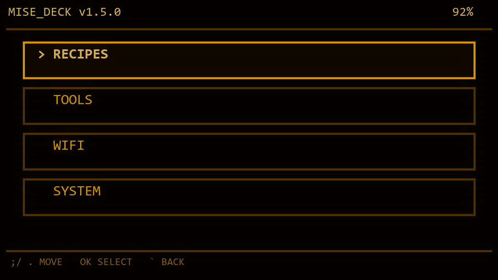
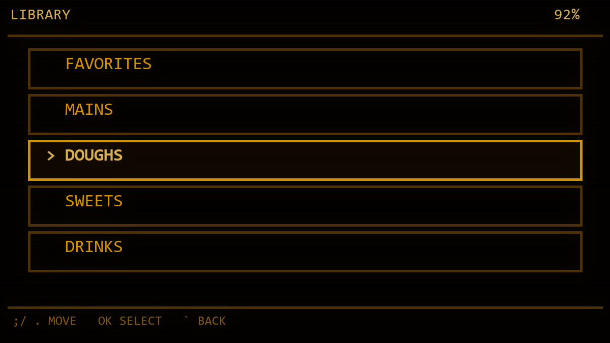
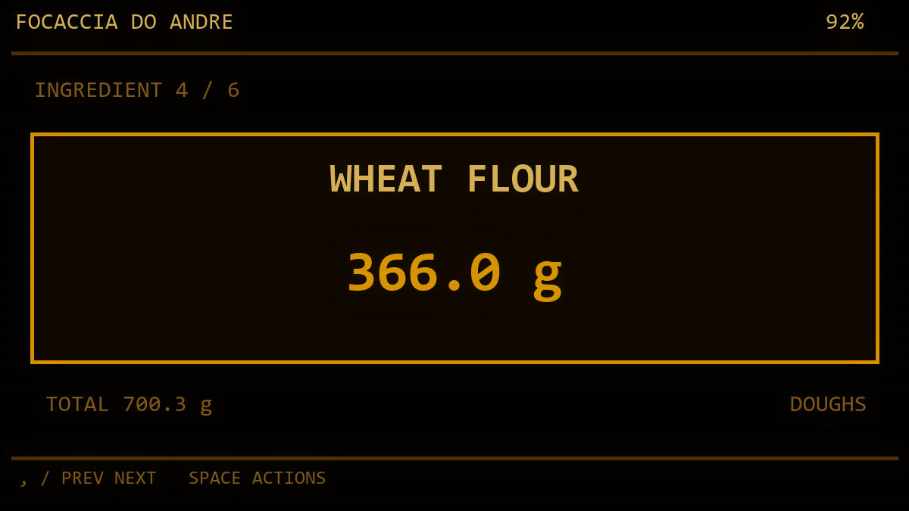
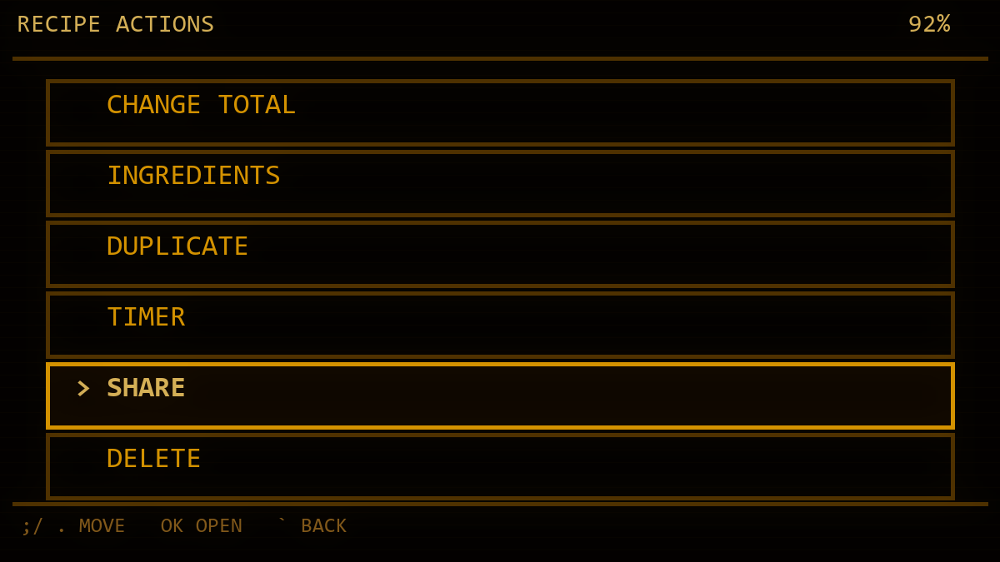
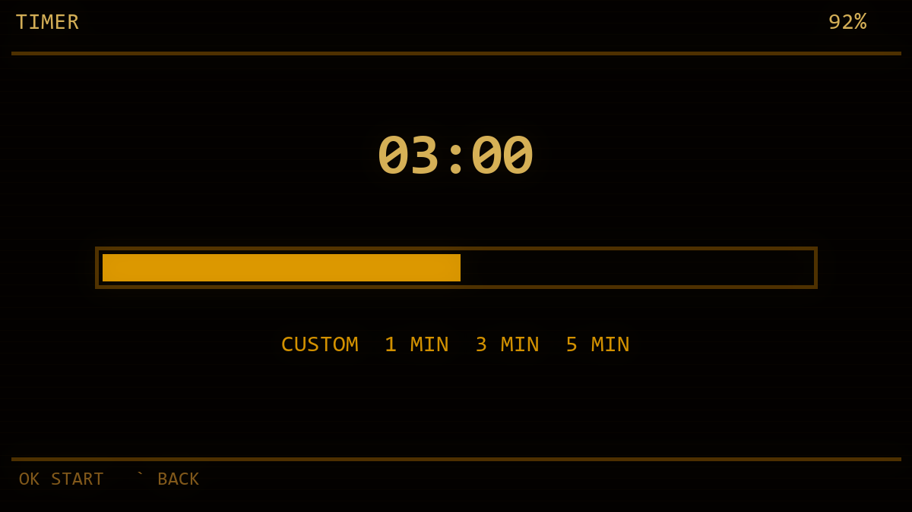
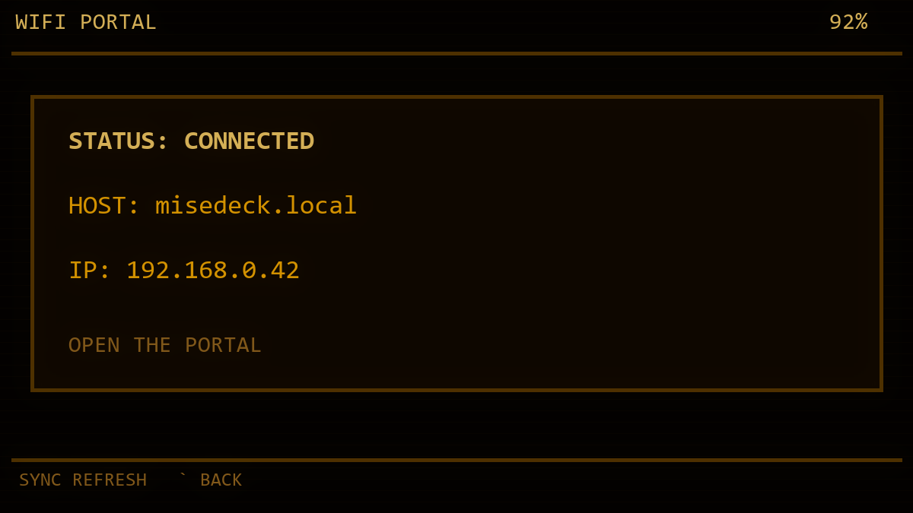
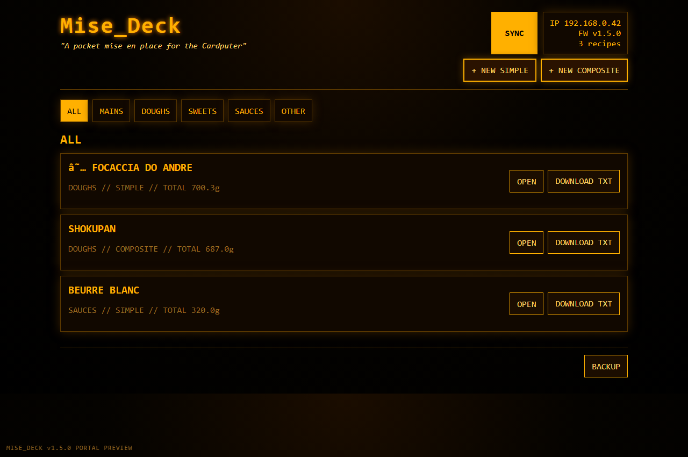
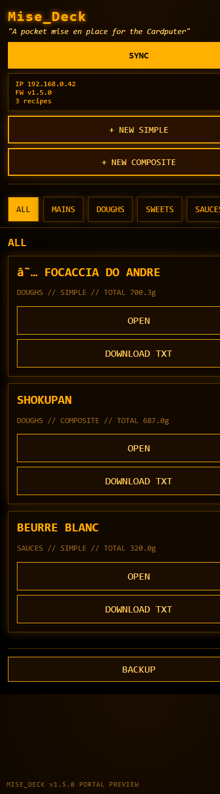
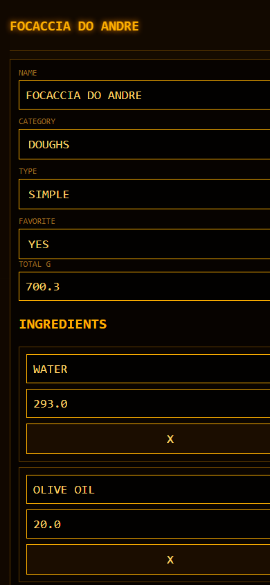
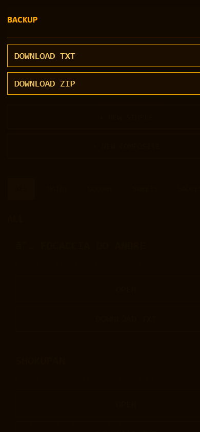

# Mise_Deck

**Um mise en place de bolso e caixa de ferramentas culinária para o M5Stack Cardputer.**

O Mise_Deck transforma o M5Stack Cardputer em um pequeno companheiro de cozinha para escalar receitas, gerenciar ingredientes, usar timers, compartilhar receitas offline e acessar um portal local pelo navegador.

> *"nós somos os músicos e somos os sonhadores de sonhos"*

O Mise_Deck foi idealizado por **André Fuentes** / **@anfuentz** e vibecodeado com **Codex**.

## Release atual

**v1.5.0** - builds em inglês e português brasileiro estão disponíveis.

## Preview da interface

### Menu principal

A interface do Cardputer segue uma estética amber terminal/cyberdeck, com menus grandes e dicas de navegação sempre visíveis.



### Biblioteca de receitas

As receitas ficam salvas localmente no microSD e são organizadas por categorias e favoritas.



### Visão da receita

A visualização da receita foi redesenhada para a tela pequena do Cardputer: ingredientes e preparos aparecem um por vez, com pesos grandes e fáceis de ler.



### Ações da receita

Cada receita tem um menu de ações para recalcular proporção, editar ingredientes, duplicar, usar timer, compartilhar e apagar.



### Timer e ferramentas

O Mise_Deck inclui ferramentas de cozinha como timer, cálculo rápido, conversor, tela de bateria e controle de som/volume.



### Wi-Fi e portal local

Depois de conectar ao Wi-Fi, o Cardputer cria um portal local acessível por `misedeck.local` ou pelo IP mostrado na tela.



## Portal no navegador

O portal foi pensado para celular e desktop. Ele roda diretamente no Cardputer dentro da rede local; não é um serviço de nuvem e não precisa de conta.

### Visão desktop

Navegue pelas receitas por categoria, abra receitas, baixe TXT, crie novas receitas, sincronize e acesse as opções de backup.



### Biblioteca no celular

No celular, o portal usa ações empilhadas, abas horizontais por categoria e botões maiores para toque.



### Editor guiado

Crie e edite receitas por campos guiados, sem precisar mexer diretamente no TXT. Os dados são normalizados em caixa alta para manter consistência.



### Backup

O menu de backup oferece exportação da biblioteca em TXT ou receitas individuais em um arquivo ZIP.



## Destaques

- Salva receitas no microSD
- Organiza receitas por categoria e favoritas
- Suporta receitas simples e compostas
- Recalcula receitas proporcionalmente pelo peso total
- Permite criar, duplicar, editar e apagar receitas no Cardputer
- Permite mover o cursor durante edição de textos e números
- Inclui modo rápido para cálculos proporcionais
- Inclui timer, conversor, tela de bateria e controle de som/volume
- Conecta ao Wi-Fi pelo próprio Cardputer
- Cria um portal local em `misedeck.local` ou pelo IP do aparelho
- Tem interface responsiva para celular
- Permite editar, salvar, apagar e baixar arquivos TXT de receita pelo navegador
- Oferece backup em TXT e ZIP pelo portal
- Compartilha receitas offline por uma página local servida pelo Cardputer

## Hardware

Pensado para:

- M5Stack Cardputer
- M5Stack Cardputer ADV / Cardputer-Adv

O projeto usa o target ESP32-S3 / StampS3 usado pelo Cardputer.

## Controles

Controles principais:

- `;` - cima
- `.` - baixo
- `,` - esquerda / anterior
- `/` - direita / próximo
- `OK` / `Enter` - confirmar
- `` ` `` / `Esc` - voltar / cancelar
- `Del` - apagar caractere
- `Tab` - favoritar/desfavoritar receita

Durante edição de texto ou número:

- `,` - mover cursor para esquerda
- `/` - mover cursor para direita
- `Del` - apagar antes do cursor

## Formato TXT das receitas

Formato simples e legível:

```txt
FOCACCIA DO ANDRE
CATEGORIA: MASSAS
FAVORITA: SIM
TOTAL: 700.3

[INGREDIENTES]

AGUA|293.0|g
ACUCAR|8.0|g
AZEITE|20.0|g
FARINHA DE TRIGO|366.0|g
FERMENTO|3.3|g
SAL|10.0|g
```

Receitas compostas usam blocos `[PREPARO]`.

## Compartilhamento offline

O Mise_Deck pode iniciar um fluxo de compartilhamento offline:

```text
Receita > Ações > Compartilhar
```

O QR não precisa da rede Wi-Fi da casa. Ele ajuda o celular a conectar diretamente no modo de compartilhamento do Cardputer e abrir uma página local da receita com opções de copiar e baixar.

## Compilação

Recomendado: PlatformIO.

```bash
pio run
pio run -t upload
```

Validado com:

- PlatformIO
- M5Cardputer `1.1.1`
- M5Unified `0.2.17`
- M5GFX `0.2.24`
- Arduino framework para ESP32

Veja [docs/INSTALL.md](docs/INSTALL.md) para instruções de gravação.

## Binários da release

- Inglês: `releases/v1.5.0/Mise_Deck_Cardputer_v1.5.0_EN.bin`
- Português/Brasil: `releases/v1.5.0/Mise_Deck_Cardputer_v1.5.0_PT-BR.bin`

## Documentação

- [Instalação](docs/INSTALL.md)
- [Funcionalidades](docs/FEATURES.md)
- [Portal](docs/PORTAL.md)
- [Roadmap](docs/ROADMAP.md)
- [Checklist de release](docs/RELEASE_CHECKLIST.md)
- [README em inglês](README.md)

## Licença

Mise_Deck é distribuído sob a [licença MIT](LICENSE).
